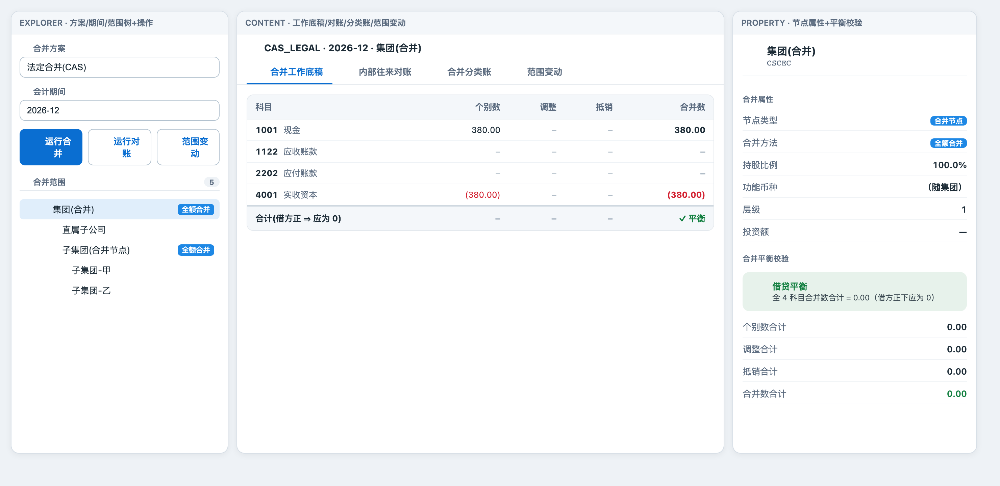
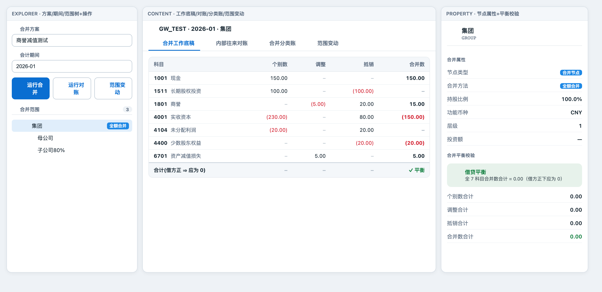
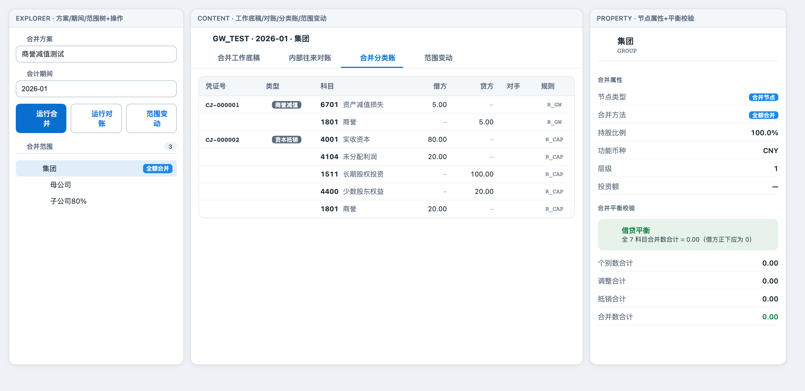
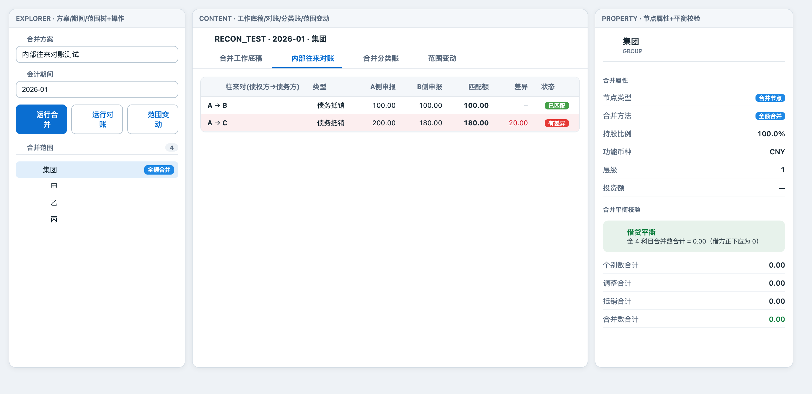
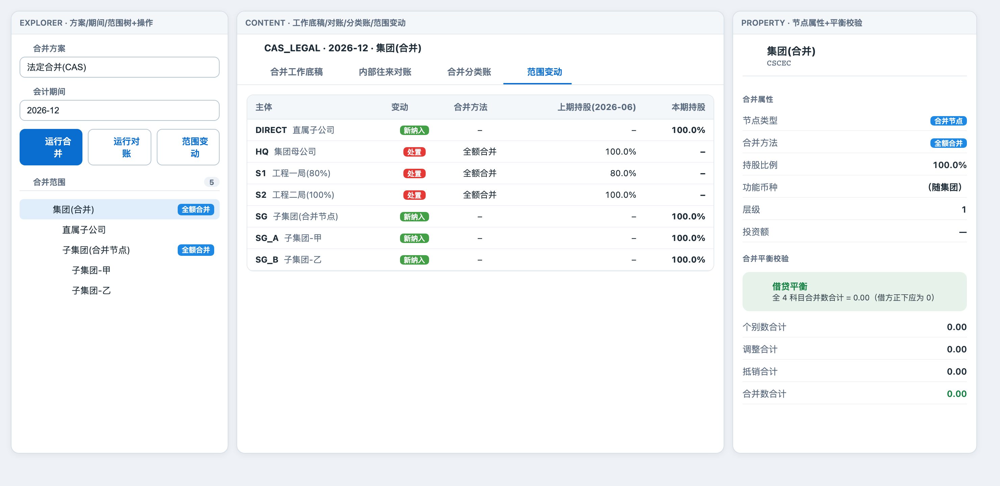
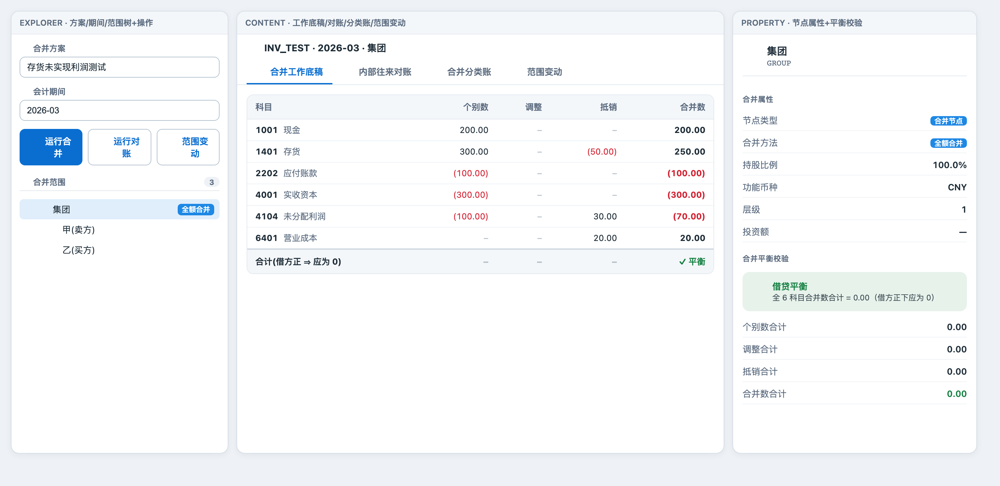
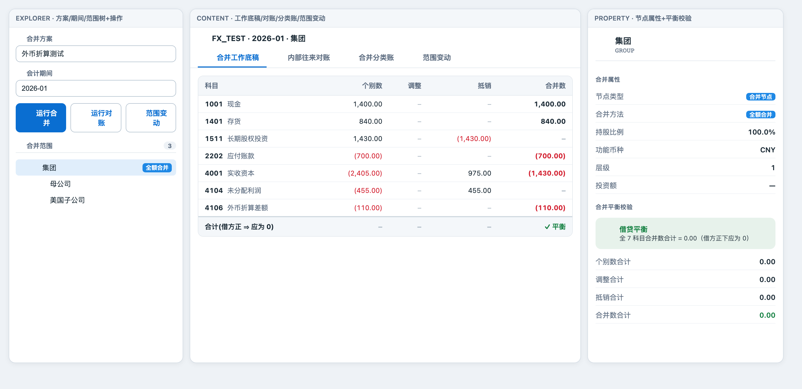

# 合并报表工作台 —— 前端功能截图

真机测试:经门户 `:8080` 反代 → report-server `:8092`,加载 native page `portal.consol.workbench`,
逐功能驱动并截图。生成脚本 `cmx-report/scripts/shots-consol-workbench.mjs`;
功能断言脚本 `cmx-report/scripts/e2e-consol-workbench.mjs`(17/17 绿)。

工作台四区:explorer(方案/期间/范围树 + 运行合并·运行对账·范围变动)、content(工作底稿/对账/分类账/范围变动 四 tab)、property(节点属性 + 借贷平衡校验)。

| 截图 | 功能 | 核对要点 |
|---|---|---|
|  | 三区总览(CAS_LEGAL) | explorer 三按钮 + 范围树;content 工作底稿五列;property 平衡校验;合计 ✓平衡 |
|  | 切方案 + 工作底稿·调整栏 | GW_TEST 商誉调整(5.00)、抵销20 → 合并 15.00;资产减值损失 5.00;✓平衡 |
|  | 合并分类账 tab | CJ-000001 商誉减值 + CJ-000002 资本抵销;凭证号仅首行、类型徽标、借贷分列、规则码 R_GW/R_CAP |
|  | property 平衡校验特写 | 借贷平衡卡「全7科目合并数合计=0」绿色(与 02/03 右栏同) |
|  | 内部往来对账 tab | A→B 匹配100「已匹配」绿;A→C 匹配180/差异20 红底行 + 红「有差异」徽标 |
|  | 范围变动 tab | 7 项:DIRECT/SG/SG_A/SG_B 绿「新纳入」、HQ/S1/S2 红「处置」;上期持股列标注 (2026-06) |
|  | 存货未实现利润 | 存货抵销(50)→250、未分配利润期初结转30→(70)、营业成本20;✓平衡 |
|  | 外币折算 | 现金1400/存货840(×汇率)、外币折算差额 4106 (110.00) CTA 单列;✓平衡 |

> 负数以括号 + 红色展示;权益/负债类展示口径已翻正。数据均由后端合并引擎(cg_consol_data)实时取数,与工作底稿逐一对得上。
