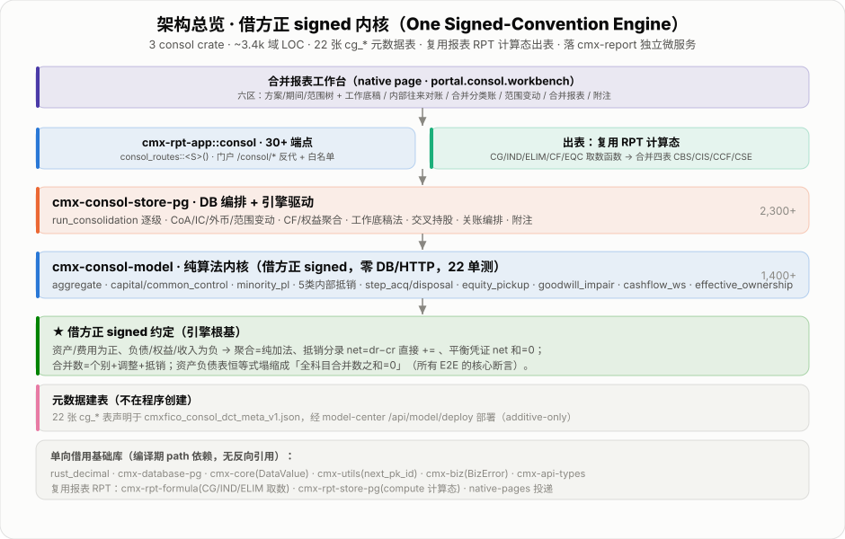
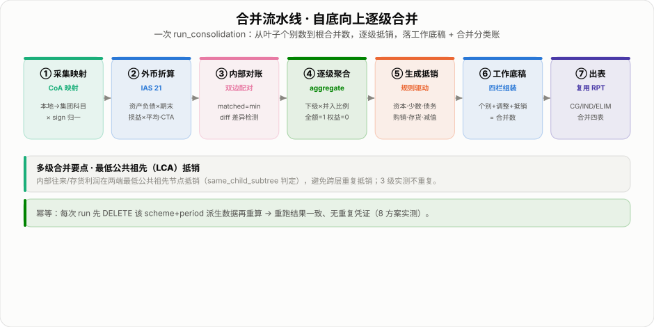
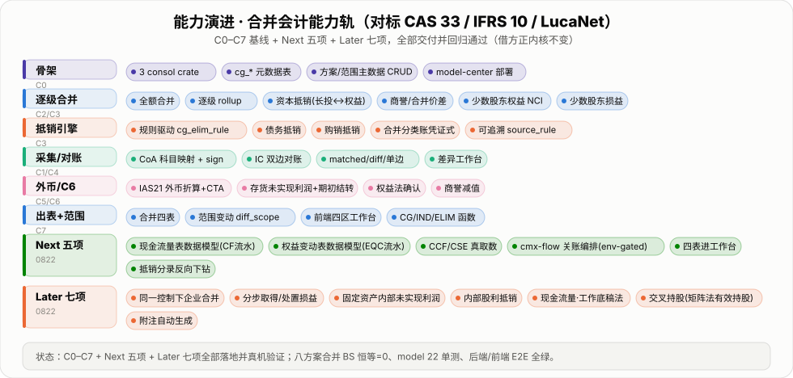
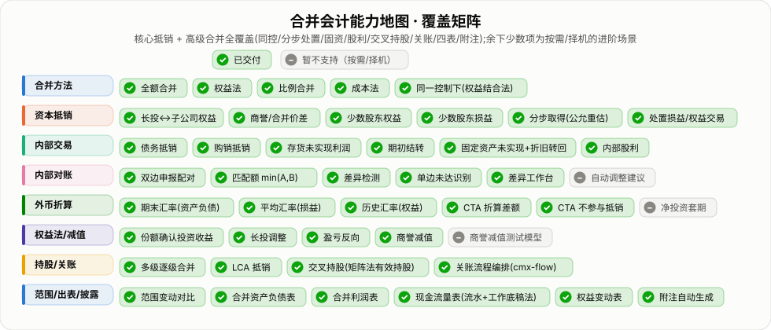
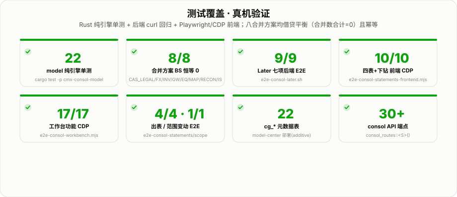
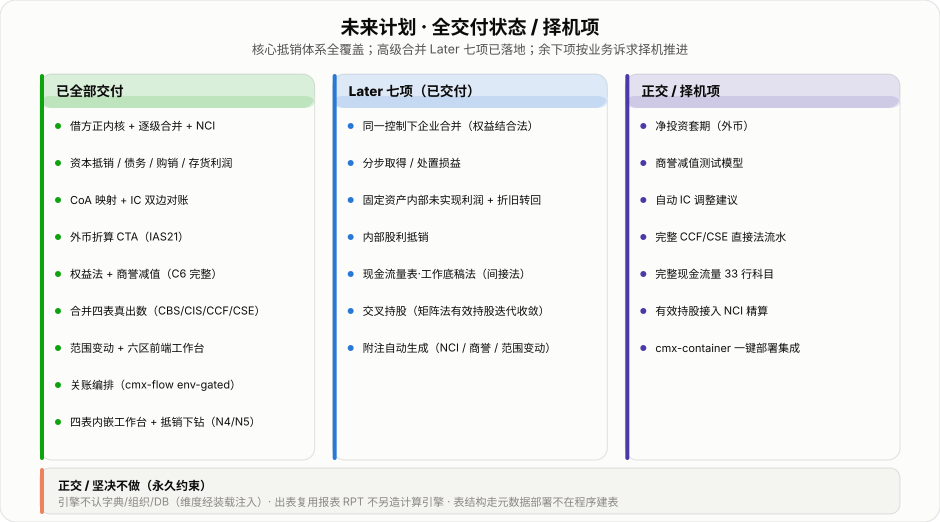

# cmx-report 合并报表平台 · 阶段性总结（v2）

> 平台定位：集团合并报表一体化 —— 从个别财务数据到四张合并报表 + 附注，遵循 CAS 33 / IFRS 10 / IAS 21 / CAS 20，
> 对标 LucaNet 商业产品，以 Rust 纯函数内核 + PostgreSQL 编排层 + 报表 RPT 出表复用架构落地。
>
> **本版（v2）相对 v1 的增量**：在 C0–C7 基线之上，新增 **Next 五项**（现金流量/权益变动真数据模型、cmx-flow 关账编排、四表进工作台、抵销下钻）
> 与 **Later 七项**（同一控制下合并、分步取得/处置、固定资产内部未实现利润、内部股利、现金流量工作底稿法、交叉持股矩阵法、附注自动生成），
> **高级合并会计能力全覆盖**。旧版见 `cmx-report合并报表平台-阶段性总结.md`（保留）。

---

## TL;DR

| 项目 | v1 | **v2（本版）** |
|---|---|---|
| 后端域代码行数 | ~2,750 LOC | **~3,700 LOC**（model 1,400+ / store 2,300+） |
| 元数据表 | 15 张 `cg_*` | **22 张 `cg_*`**（meta-JSON 声明，model-center 部署） |
| model 纯引擎单测 | 12 | **22** |
| API 端点 | 22 条 | **30+ 条**（`consol_routes::<S>()`） |
| 前端工作台 | 四区 4 tab | **六区 6 tab**（+合并报表 +附注） |
| 合并四表 | CBS/CIS 真数、CCF/CSE 壳 | **CBS/CIS/CCF/CSE 全部真取数** |
| 高级合并能力 | 核心抵销 | **同控/分步处置/固资/股利/交叉持股/关账/附注 全交付** |
| 合并方案 BS 恒等 | 8/8 | **8/8**（+ CC_TEST/XH_TEST 专项，全部 = 0） |

架构核心：**借方正（debit-positive）signed 约定** —— 资产/费用为正、负债/权益/收入为负；
所有聚合 = 纯加法；抵销分录 `net = dr − cr`，直接 `+=`；合并资产负债表恒等式塌缩为「全科目合并数之和 = 0」。
这一约定贯穿引擎全部算法（含本版新增的 12 项高级合并），是所有 E2E 断言的数学根基。



---

## 一、架构：借方正内核 + 三 crate + RPT 出表复用

```
前端工作台（portal.consol.workbench，六区）
   工作底稿 / 内部往来对账 / 合并分类账 / 范围变动 / 合并报表 / 附注
        │
cmx-rpt-app::consol  ──  consol_routes::<S>()  30+ 端点
        │                        │
cmx-consol-store-pg              │  出表：CG/IND/ELIM/CF/EQC 函数
   run_consolidation             └──→ cmx-rpt-formula + cmx-rpt-store-pg
   CF/权益聚合 · 工作底稿法              合并四表 CBS / CIS / CCF / CSE
   交叉持股 · 关账编排 · 附注
        │
cmx-consol-model（纯算法，零 DB/HTTP，22 单测）
   aggregate · capital / common_control · minority_pl
   debt/sales/inventory/fixed_asset/dividend 抵销
   step_acquisition · disposal · equity_pickup · goodwill_impairment
   translate_entity · reconcile · diff_scope
   derive_cash_flow_worksheet · effective_ownership
        │
22 张 cg_* 元数据表（cmxfico_consol_dct_meta_v1.json，model-center 部署）
```

**三 crate 分工**

| crate | 定位 | 约 LOC |
|---|---|---|
| `cmx-consol-model` | 纯算法内核，借方正约定，零 DB / HTTP，**22 单测** | 1,400+ |
| `cmx-consol-store-pg` | DB 编排 + 引擎驱动（合并/CF/权益/工作底稿法/交叉持股/关账/附注） | 2,300+ |
| `cmx-rpt-app::consol` | 薄 API 层，`consol_routes::<S>()` 泛型路由，30+ 端点 | ~260 |

**新增 store 模块**：`cashflow.rs`（CF/权益聚合 + 工作底稿法）、`close.rs`（关账编排）、`flow_client.rs`（env-gated cmx-flow HTTP）、`crossholding.rs`（交叉持股）、`notes.rs`（附注）。

**基础库单向借用**（编译期 path 依赖，无反向引用）：
`rust_decimal · cmx-database-pg · cmx-core · cmx-utils · cmx-biz · cmx-api-types`

**出表复用报表 RPT**：`cmx-rpt-formula`（CG/IND/ELIM/**CF/EQC** 取数函数）+ `cmx-rpt-store-pg`（compute 计算态）+ native-pages 投递。

---

## 二、合并流水线：自底向上七步



### 关键设计要点

**最低公共祖先（LCA）抵销**：内部往来、存货 / 固定资产未实现利润在两端 LCA 节点执行抵销（`same_child_subtree` 判定），避免跨层重复抵销。

**幂等性**：每次 `run_consolidation` 先 `DELETE` 该 `scheme + period` 派生数据再重算，重跑结果一致、无重复凭证。

**借方正工作底稿四栏**：个别数 + 调整数 + 抵销数 = 合并数（合计恒等 = 0）。本版所有新增高级抵销（同控/分步/固资/股利）均自平衡，恒等式保持。

---

## 三、能力演进（C0 → C7 + Next 五项 + Later 七项）



### Next 五项（现金流量/权益真数据 + 关账 + 前端）

| 项 | 交付 |
|---|---|
| N1 现金流量表数据模型 | `cg_cash_flow_item` 流水表 + 逐级聚合 + 内部现金流抵销 |
| N2 权益变动表数据模型 | `cg_equity_change` 流水表 + `CF`/`EQC` 取数函数 → CCF/CSE 真取数 |
| N3 cmx-flow 关账编排 | 采集→对账→合并→**复核门**→出表；env-gated 真流程实例 + 服务内 degrade |
| N4 合并四表进工作台 | 工作台第 5 tab「合并报表」内嵌只读 compute 预览 |
| N5 抵销分录反向下钻 | 工作底稿抵销栏 ↔ 合并分类账 双向下钻高亮 |

### Later 七项（高级合并会计）

| 项 | 会计口径 | 引擎 |
|---|---|---|
| L1 同一控制下企业合并 | 权益结合法：账面价值、**不确认商誉**、差额入资本公积 | `common_control_elimination` |
| L2 分步取得 / 处置损益 | 原持股公允重估→投资收益；处置权益交易 / 丧失控制损益 | `step_acquisition` / `disposal` |
| L3 固定资产内部未实现利润 | 抵原值利润 + **逐期折旧转回**（×已用/总年限） | `fixed_asset_profit_elimination` |
| L4 内部股利抵销 | Dr 投资收益 / Cr 未分配利润（复用 IC 匹配，无新表） | `dividend_elimination` |
| L5 现金流量表·工作底稿法 | 间接法：两期合并数差额推三活动（Δcash=−Σ非现金） | `derive_cash_flow_worksheet` |
| L6 交叉持股（矩阵法） | 迭代收敛 `eff = d + eff·M` 求有效持股 | `effective_ownership` |
| L7 附注自动生成 | 少数股东权益 / 商誉变动 / 范围变动，从 `cg_*` 派生 | `generate_notes` |

---

## 四、合并会计能力地图



核心抵销 + 高级合并**全覆盖**（`✓` 已交付并回归通过）：同一控制下、分步取得/处置、固定资产内部未实现利润、内部股利、交叉持股、关账编排、合并四表、附注自动生成。
余下少数项（`–`，按需/择机）：净投资套期、商誉减值测试模型、自动 IC 调整建议。

---

## 五、测试覆盖



### 测试套件详情

| 套件 | 结果 | 说明 |
|---|---|---|
| `cargo test -p cmx-consol-model` | **22 / 22** | 纯引擎算法单测（含本版新增 10 个高级合并单测） |
| 8 合并方案 BS 恒等 | 8 / 8 | 全科目合并数合计 = 0；+ CC_TEST/XH_TEST 专项 |
| `e2e-consol-later.sh`（L1–L7 curl） | **9 / 9** | 七项高级合并后端往返断言 |
| `e2e-consol-statements-frontend.mjs`（CDP） | **10 / 10** | 四表内嵌预览 + 抵销下钻联动 |
| `e2e-consol-workbench.mjs`（CDP） | **17 / 17** | 六区工作台功能断言 |
| `e2e-consol-statements.sh` / `-scope-change.sh` | 4 / 4 · 1 / 1 | 出表 / 范围变动 E2E |
| `cg_*` 元数据表 | **22 张** | model-center 部署验证（additive-only） |
| consol API 端点 | **30+ 条** | `consol_routes::<S>()` |

**核心验证断言**（每个合并方案、每项高级抵销后均满足）：

```
Σ(所有科目合并数) = 0   ← 借方正恒等式，幂等重跑结果一致
OP + INV + FIN = 现金实际变动   ← L5 工作底稿法间接法恒等
eff = d + eff·M 收敛   ← L6 交叉持股有效持股（closed-form 验证）
```

---

## 六、22 张 cg_* 元数据表

全部声明于 `cmxfico_consol_dct_meta_v1.json`，经 model-center `/api/model/deploy` 部署（additive-only，零停机）。

**基线 15 张**：`cg_consol_scheme` · `cg_group_account` · `cg_entity_balance` · `cg_coa_mapping` · `cg_fx_rate` · `cg_scope` · `cg_elim_rule` · `cg_ic_match` · `cg_elim_journal` · `cg_consol_data` · `cg_interim_profit` · `cg_ic_declaration` · `cg_ic_recon` · `cg_goodwill_impair` · `cg_scope_change`

**本版新增 7 张 / 列**：

| 表 / 列 | 用途 |
|---|---|
| `cg_cash_flow_item` | 现金流量项目流水（N1；node_code 二态区分主体/聚合） |
| `cg_equity_change` | 权益变动流水（N2） |
| `cg_close_run` / `cg_close_step` | 关账编排运行头 + 步骤审计（N3） |
| `cg_step_txn` | 分步取得 / 处置交易（L2） |
| `cg_fa_profit` | 固定资产内部交易未实现利润（L3） |
| `cg_shareholding` | 交叉持股关系（L6） |
| `cg_scope.under_common_control` · `cg_consol_scheme.capital_reserve_account` | 同一控制标记 + 资本公积科目（L1，additive 补列） |

---

## 七、未来计划



### 正交 / 坚决不做（永久约束）

- 引擎不认字典 / 组织 / DB（维度经装载注入）
- 出表复用报表 RPT，不另造计算引擎
- 表结构走元数据部署，不在程序建表

---

*生成时间：2026-08-23 · 工具链 gen-svgs-v2 → shot 验图（CVD-安全调色板，自包含浅色卡片 SVG，输出 assets/v2/）· 代码默认不提交*
