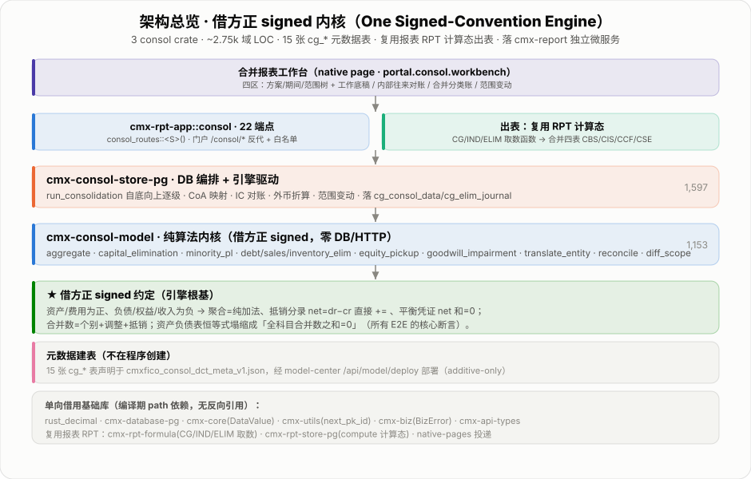
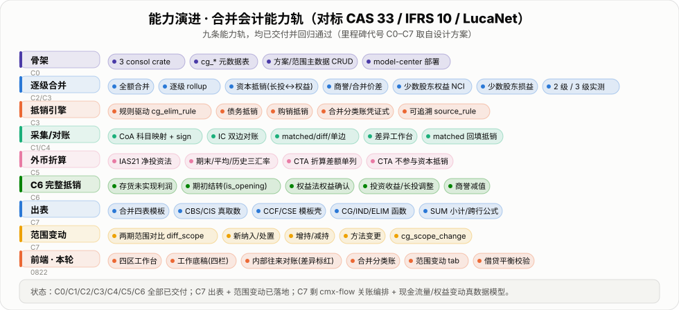
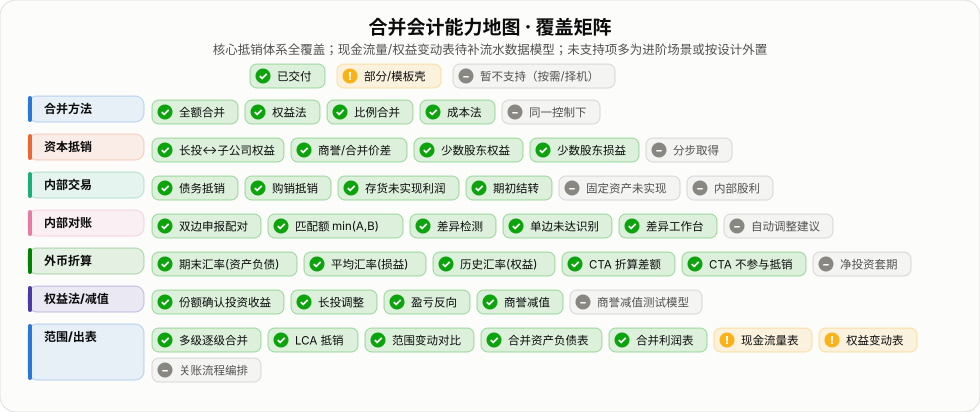
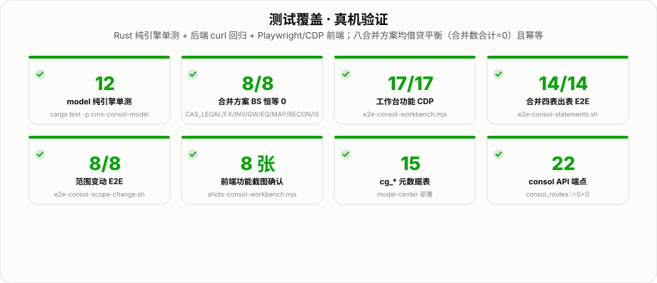
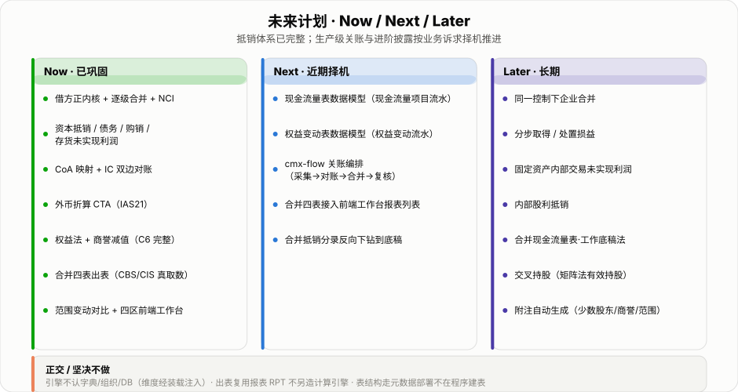

# cmx-report 合并报表平台 · 阶段性总结

> 平台定位：集团合并报表一体化 —— 从个别财务数据到四张合并报表，遵循 CAS 33 / IFRS 10 / IAS 21，
> 对标 LucaNet 商业产品，以 Rust 纯函数内核 + PostgreSQL 编排层 + 报表 RPT 出表复用架构落地。

---

## TL;DR

| 项目 | 数值 |
|---|---|
| 后端域代码行数 | ~2,750 LOC（model 1,153 + store 1,597） |
| 元数据表 | 15 张 `cg_*`（meta-JSON 声明，model-center 部署） |
| API 端点 | 22 条（`consol_routes::<S>()`） |
| 合并方案 BS 恒等 | 8/8（全科目合并数合计 = 0） |
| 单元测试 | 12 model 纯算法 + 多套综合回归 |
| 前端工作台功能 | 四区（explorer / content 4-tab / property） |
| 合并四表 | CBS/CIS 真取数；CCF/CSE 模板壳 |

架构核心：**借方正（debit-positive）signed 约定** —— 资产/费用为正、负债/权益/收入为负；
所有聚合 = 纯加法；抵销分录 `net = dr − cr`，直接 `+=`；合并资产负债表恒等式塌缩为「全科目合并数之和 = 0」。
这一约定贯穿引擎全部算法，是所有 E2E 断言的数学根基。



---

## 一、架构：借方正内核 + 三 crate + RPT 出表复用

```
前端工作台（portal.consol.workbench，四区）
        │
cmx-rpt-app::consol  ──  consol_routes::<S>()  22 端点
        │                        │
cmx-consol-store-pg              │  出表：CG/IND/ELIM 函数
   run_consolidation             └──→ cmx-rpt-formula + cmx-rpt-store-pg
   自底向上逐级                        合并四表 CBS / CIS / CCF / CSE
        │
cmx-consol-model（纯算法，零 DB/HTTP）
   aggregate · capital_elimination · minority_pl
   debt/sales/inventory_elim · equity_pickup
   goodwill_impairment · translate_entity
   reconcile · diff_scope
        │
15 张 cg_* 元数据表（cmxfico_consol_dct_meta_v1.json，model-center 部署）
```

**三 crate 分工**

| crate | 定位 | LOC |
|---|---|---|
| `cmx-consol-model` | 纯算法内核，借方正约定，零 DB / HTTP | 1,153 |
| `cmx-consol-store-pg` | DB 编排，run_consolidation 自底向上驱动 | 1,597 |
| `cmx-rpt-app::consol` | 薄 API 层，`consol_routes::<S>()` 泛型路由 | ~177 |

**基础库单向借用**（编译期 path 依赖，无反向引用）：
`rust_decimal · cmx-database-pg · cmx-core · cmx-utils · cmx-biz · cmx-api-types`

**出表复用报表 RPT**（不另造计算引擎）：
`cmx-rpt-formula`（CG/IND/ELIM 取数函数）+ `cmx-rpt-store-pg`（compute 计算态）+ native-pages 投递

---

## 二、合并流水线：自底向上七步


### 关键设计要点

**最低公共祖先（LCA）抵销**
内部往来、存货未实现利润在两端 LCA 节点执行抵销（`same_child_subtree` 判定），
避免跨层重复抵销；3 级实测不重复。

**幂等性**
每次 `run_consolidation` 先 `DELETE` 该 `scheme + period` 的派生数据再重算，
重跑结果一致、无重复凭证（8 方案实测）。

**借方正工作底稿四栏**

| 栏 | 含义 |
|---|---|
| 个别数 | 原始个别财务数据（经 CoA 映射 + 外币折算） |
| 调整数 | 权益法确认投资收益 / 商誉减值 |
| 抵销数 | 资本/少数/债务/购销/存货等抵销分录合计 |
| 合并数 | 个别 + 调整 + 抵销（合计恒等 = 0） |

---

## 三、能力演进（C0 → C7）



### 里程碑一览

| 里程碑 | 能力 | 状态 |
|---|---|---|
| C0 | 骨架：3 crate + cg_* 元数据建表 + 方案/范围主数据 CRUD | ✓ |
| C1 | CoA 科目映射（entity→集团，sign 归一）| ✓ |
| C2/C3 | 全额合并 + 逐级 rollup + 资本抵销（长投↔权益）+ 商誉/合并价差 | ✓ |
| C3 | 少数股东权益 NCI + 少数股东损益；规则驱动 cg_elim_rule | ✓ |
| C3 | 债务/购销抵销；合并分类账凭证式；可追溯 source_rule | ✓ |
| C4 | IC 双边对账：matched/diff/单边；差异工作台 | ✓ |
| C5 | IAS 21 外币折算（期末/平均/历史三汇率）+ CTA 折算差额单列 | ✓ |
| C6 | 存货未实现利润 + 期初结转 + 权益法 + 投资收益/长投调整 + 商誉减值 | ✓ |
| C7 | 合并四表（CBS/CIS 真取数，CCF/CSE 模板壳）+ 范围变动对比 + 前端工作台 | ✓ |

---

## 四、合并会计能力地图



核心抵销体系全部覆盖；`✓` 已交付并通过回归。
未支持项（`–`）多为进阶场景（同一控制下合并、分步取得处置损益、固定资产内部未实现利润）
或按设计外置（完整 CCF/CSE 数据模型 = 待补现金流/权益变动流水）。

---

## 五、测试覆盖



### 测试套件详情

| 套件 | 结果 | 说明 |
|---|---|---|
| `cargo test -p cmx-consol-model` | 12 / 12 | 纯引擎算法单测（无 DB） |
| 8 合并方案 BS 恒等 | 8 / 8 | CAS_LEGAL / FX_TEST / INV_TEST / GW_TEST / EQ_TEST / MAP_TEST / RECON_TEST / IS_TEST |
| `e2e-consol-workbench.mjs`（CDP） | 17 / 17 | 前端四区工作台功能断言 |
| `e2e-consol-statements.sh` | 14 / 14 | 合并四表出表 curl 回归 |
| `e2e-consol-scope-change.sh` | 8 / 8 | 范围变动 E2E |
| 前端功能截图确认 | 8 张 | `shots-consol-workbench.mjs`，存 `docs/screenshots/` |
| `cg_*` 元数据表 | 15 张 | model-center 部署验证 |
| consol API 端点 | 22 条 | `consol_routes::<S>()` |

**核心验证断言**（每个合并方案均满足）：

```
Σ(所有科目合并数) = 0   ← 借方正恒等式，8/8 方案通过，幂等重跑结果一致
```

---

## 六、15 张 cg_* 元数据表

全部声明于 `cmxfico_consol_dct_meta_v1.json`，经 model-center `/api/model/deploy` 部署（additive-only，零停机）。

| 表名 | 用途 |
|---|---|
| `cg_consol_scheme` | 合并方案（含 cta_account 外币折算差额科目） |
| `cg_scope` | 合并范围节点（currency 外币标识） |
| `cg_elim_rule` | 抵销规则 |
| `cg_consol_data` | 合并计算结果（工作底稿四栏） |
| `cg_elim_journal` | 合并分类账凭证 |
| `cg_coa_mapping` | 科目映射（entity→集团，entity="" = 通配） |
| `cg_fx_rate` | 汇率（期末/平均/历史） |
| `cg_interim_profit` | 存货未实现利润（含期初结转） |
| `cg_goodwill_impair` | 商誉减值 |
| `cg_ic_declaration` | 内部往来申报 |
| `cg_ic_recon` | 内部往来对账结果 |
| `cg_scope_change` | 范围变动记录 |
| `cg_consol_period` | 合并期间 |
| `cg_account` | 集团统一科目 |
| `cg_account_balance` | 个别科目余额 |

---

## 七、未来计划



### 正交 / 坚决不做

- 引擎不认字典 / 组织 / DB（维度经装载注入）
- 出表复用报表 RPT，不另造计算引擎
- 表结构走元数据部署，不在程序建表

---

*生成时间：2026-08-22 · 工具链 gen-svgs → shot 验图（CVD-安全调色板，自包含浅色卡片 SVG）*
